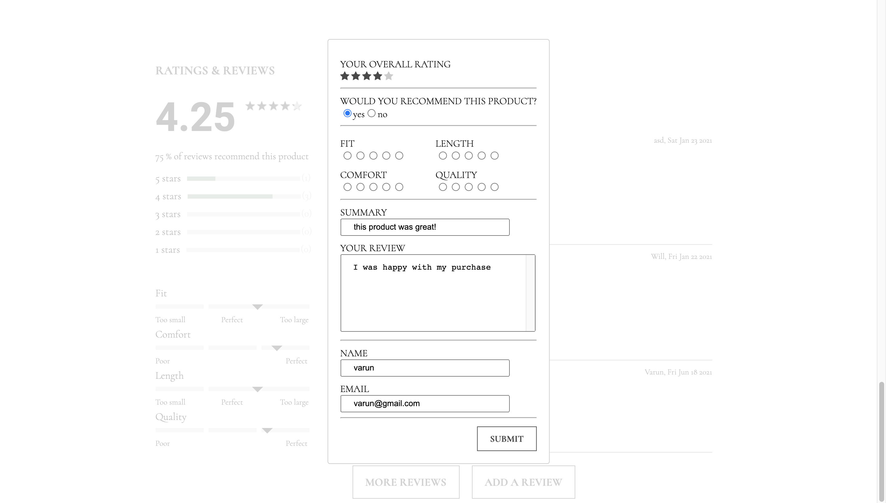

# Project Catwalk
Project Catwalk is a front-end e-commerce store front for online shoppers

## Table of Contents

1. **Product Overview:** View product with related images. Access or change style to see corresponding images and product name and product price. Includes add to cart and social media sharing features.

2. **Related Products:** Browse and compare products related to the product currently displayed in overview. Includes save feature allowing users to favorite their product for future purchase or viewing.

3. **Ratings And Reviews:** A page that allows users to see what other users reviews and ratings of the product they are currently viewing. Each user can add a review and contribute to the rating and reviews page.

## Tech/framework used

**Built With**
- Javascript
- Node.js
- Express
- React
- Redux
- SASS

## Product Overview

## Related Products

  -**USER EXPERIENCE:**

      <Image of Carousels>

      The Related Products widget is comprised of two carousels.

      Product cards populate both carousels.  Each card is associated with a  product and contains its image, category, name, price (and sale price if applicable) and star rating.

      A button in the top right of each card allows for a certain action made upon the card depending on the carousel.

      Clicking anywhere on a product card aside from the action button will update the Product Overview to display the clicked product.

      A maximum of 4 cards are displayed at any given time.

      Arrows on either side of the carousels allow lateral movement by one card at a time.  If a carousel has no products, the buttons are hidden.  If a carousel has 1 to 4 products, both buttons appear but are translucent and unresponsive.  With more than 4 products on load, the arrows will be either translucent and unresponsive to click or opaque and responsive to click depending on a given position within the carousel.

-**Related Products Carousel**

      Comprised of all products related to the main product in Product Overview

      Action Button: Clicking the action button on a Related Products card opens a modal view allowing the user to compare features of the related product with the current product in Product Overview:
      <GIF EXAMPLE>

-**My Outfit Carousel**

      Comprised of an Add To Outfit button on the far left of the carousel followed by all products saved to the carousel by the user either through the Product Overview save feature or the clicking on the Add To Outfit button.

      Action Button: Clicking the action button on a My Outfit card removes the card from the My Outfit carousel:
      <GIF EXAMPLE>

## Ratings And Reviews

The ratings and reviews widget allow users to view reviews before purchasing a product. The meta reviews on the left side allows to user to view averaged ratings past users have given and the right hand side allows users to see individual ratings. The widget also includes a write a review feature that allows the current user to write a review.

1. Product Breakdown and Review List
  
    * implemented a sorting system
    * translated data given to me by the black box API into visual data
    * dynamically rendered reviews from black box API

2. Add A Review
 
    * Allows current user to add a new review
    * Implemented a modal to contain the form information

-**DATA INTEGRATION AND COMPONENT ORGANIZATION**

    -API and Data Retrieval
      Due to its hub-like nature, the Related Products widget controls much of the initial API calls that populate store as well as calls to the store cache.  It is the most highly interactive widget in relation to the Product Overview widget, requiring the most expense in data retrieval out of all of the widgets during any given state of the application.

    -Though the attached redux store allows for data cacheing in the frontend, a page reload resets the store and the cache is lost.  It is therefore recommended to persist the store cache within a backend database to further reduce the expense of API calls to the company server post reload.  This linkage can be made in App.jsx

## Build Project
Follow these steps to run the project in a mac or linux environment.
- Clone down the repo in the terminal
  * `git clone https://github.com/Garganelli/Project-Catwalk.git`
- Add personal github token
  * inside client/env copy exampleConfig.js file and rename to config.js
  * replace `UPDATE ME` with github key into config.js
- Install dependencies - `npm install`
- Run webpack - `npm run build`
- Run server -
  * live-server - `npm run start`
  OR
  * node server - `npm run server`

## Developers
- **Austin Miller** - Product Overview
- **Suliman Tekalli** - Related Products
- **Varun Chillara** - Ratings And Reviews
